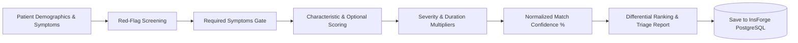

# 🩺 MediLogic AI — Clinical Diagnosis Expert System

[](https://reactjs.org/)
[](https://vitejs.dev/)
[](https://tailwindcss.com/)
[](https://insforge.dev/)
[](https://opensource.org/licenses/MIT)

> **MediLogic AI** is an educational medical diagnosis expert system. It enables users to select presenting symptoms, adjust clinical severity and onset duration, and observe a deterministic, forward-chaining rule-based inference engine evaluate candidates against a structured disease knowledge base in real-time.

---

## 📑 Table of Contents

- [Overview](#-overview)
- [Key Features](#-key-features)
- [Diagnostic Inference Pipeline](#-diagnostic-inference-pipeline)
- [Tech Stack](#-tech-stack)
- [Database Schema (InsForge PostgreSQL)](#-database-schema-insforge-postgresql)
- [Getting Started](#-getting-started)
  - [Prerequisites](#prerequisites)
  - [Installation](#installation)
  - [Environment Variables](#environment-variables)
  - [Database Setup](#database-setup)
  - [Running the Development Server](#running-the-development-server)
- [Project Structure](#-project-structure)
- [Clinical & Educational Disclaimer](#-clinical--educational-disclaimer)

---

## 🌟 Overview

Unlike black-box neural networks, **MediLogic AI** utilizes an explainable **forward-chaining clinical inference engine**. Every generated score, differential candidate, and triage level is directly traceable to explicit disease rules, required criteria, and characteristic severity factors stored in the medical catalog.

All patient assessments, diagnostic reports, and medical profiles are persistently managed using **InsForge Serverless PostgreSQL** and **InsForge Auth**.

---

## ✨ Key Features

- 🔬 **Comprehensive Symptom Catalog**: Over 40+ clinical symptoms mapped across 8 body systems (*Respiratory, Cardiovascular, Gastrointestinal, Neurological, Musculoskeletal, Dermatological, ENT, and General*).
- 🚨 **Red-Flag Emergency Detection**: Automatic triage alerts for acute life-threatening presentations (e.g., crushing chest pain, dyspnea, thunderclap headache, stiff neck with fever).
- 🎚️ **Granular Triage Parameters**: Adjustable severity sliders (1–10) and onset duration selector (`<24h`, `1-3 days`, `4-7 days`, `>1 week`).
- 🧠 **Deterministic Rule Execution**: Dynamic calculation of characteristic (+25 pts) and optional (+10 pts) symptoms with disease-specific multipliers.
- 📊 **Differential Diagnosis Ranking**: Ranked alternative possibilities with match confidence percentages and recommended specialist designations.
- 📝 **Transparent Reasoning Trace**: Live console breakdown displaying which rules fired and why conclusions were reached.
- 🖨️ **Export & Print Ready**: Generate printable clinical summaries or download plain-text assessment reports.
- 🔐 **InsForge Auth & Session Persistence**: Secure user accounts, JWT sessions, and 6-digit email OTP verification.
- 🗄️ **Persistent Patient History**: Full PostgreSQL database storage for past assessments with search, filtering, and deletion.

---

## 🔄 Diagnostic Inference Pipeline



---

## 🛠️ Tech Stack

### Frontend
- **Framework**: React 18 (SPA)
- **Bundler & Dev Server**: Vite 5
- **Styling**: Tailwind CSS 3.4 (Custom clinical slate/teal palette, glassmorphism)
- **Icons**: Lucide React
- **Typography**: Google Fonts (*Inter*, *JetBrains Mono*)

### Backend & Cloud Infrastructure (InsForge BaaS)
- **Database**: PostgreSQL with PostgREST API
- **Authentication**: InsForge Auth (Email/Password, JWT Session, 6-digit OTP verification)
- **SDK**: `@insforge/sdk`

---

## 🗄️ Database Schema (InsForge PostgreSQL)

The system operates on three primary PostgreSQL tables:

```sql
-- 1. Patient Diagnostic Reports
CREATE TABLE diagnostic_reports (
  id UUID PRIMARY KEY DEFAULT gen_random_uuid(),
  user_id TEXT,
  patient_name TEXT,
  patient_age INT,
  patient_gender TEXT,
  symptoms JSONB DEFAULT '[]'::jsonb,
  primary_condition JSONB,
  differential_conditions JSONB DEFAULT '[]'::jsonb,
  matched_symptoms JSONB DEFAULT '[]'::jsonb,
  unmatched_symptoms JSONB DEFAULT '[]'::jsonb,
  risk_level TEXT DEFAULT 'low',
  recommendations JSONB DEFAULT '[]'::jsonb,
  triage_level TEXT DEFAULT 'routine',
  created_at TIMESTAMPTZ DEFAULT NOW()
);

-- 2. User Medical Profiles
CREATE TABLE user_profiles (
  id TEXT PRIMARY KEY,
  email TEXT,
  name TEXT,
  age INT,
  gender TEXT,
  blood_group TEXT,
  allergies TEXT,
  medical_history TEXT,
  emergency_contact TEXT,
  updated_at TIMESTAMPTZ DEFAULT NOW()
);

-- 3. Medical Knowledge Base Conditions
CREATE TABLE knowledge_base_conditions (
  id TEXT PRIMARY KEY,
  name TEXT NOT NULL,
  category TEXT NOT NULL,
  description TEXT NOT NULL,
  severity TEXT NOT NULL,
  required_symptoms JSONB DEFAULT '[]'::jsonb,
  characteristic_symptoms JSONB DEFAULT '[]'::jsonb,
  optional_symptoms JSONB DEFAULT '[]'::jsonb,
  risk_level TEXT DEFAULT 'moderate',
  recommended_specialist TEXT,
  clinical_notes TEXT,
  lifestyle_guidance JSONB DEFAULT '[]'::jsonb,
  warning_signs JSONB DEFAULT '[]'::jsonb,
  created_at TIMESTAMPTZ DEFAULT NOW()
);
```

---

## 🚀 Getting Started

### Prerequisites
- [Node.js](https://nodejs.org/) (version 18.0 or higher)
- [npm](https://www.npmjs.com/) or [yarn](https://yarnpkg.com/)
- An active [InsForge](https://insforge.dev/) account and backend project.

### Installation

1. **Clone the repository**:
   ```bash
   git clone https://github.com/lokenathbid/MediLogic-AI.git
   cd MediLogic-AI
   ```

2. **Install dependencies**:
   ```bash
   npm install
   ```

### Environment Variables

Copy the template `.env.example` to `.env`:

```bash
cp .env.example .env
```

Populate your `.env` with your InsForge backend credentials:

```env
VITE_INSFORGE_URL=https://<your-app-id>.<region>.insforge.app
VITE_INSFORGE_ANON_KEY=<your-insforge-anon-key>
INSFORGE_API_KEY=<your-insforge-admin-api-key> # Only required for running migration scripts
```

### Database Setup

Initialize the required PostgreSQL tables on your InsForge instance by executing:

```bash
node scripts/setup-db.js
```

### Running the Development Server

Start the local Vite development server:

```bash
npm run dev
```

Open **`http://localhost:5173`** in your browser to explore MediLogic AI.

---

## 📁 Project Structure

```
MediLogic-AI/
├── public/                 # Static assets
├── scripts/                # Database migration and verification scripts
│   ├── setup-db.js         # Table schema initialization script
│   ├── verify-db.cjs       # CommonJS database verification script
│   └── verify-db.js        # ES module verification script
├── src/
│   ├── components/         # Reusable UI elements (Navbar, Footer, EmergencyBanner)
│   ├── context/            # AuthContext (InsForge authentication & profile state)
│   ├── lib/
│   │   ├── inferenceEngine.js  # Forward-chaining expert inference logic
│   │   ├── insforge.js         # InsForge SDK client and database helpers
│   │   └── knowledgeBase.js    # 40+ symptoms catalog & disease rule definitions
│   ├── pages/
│   │   ├── LandingPage.jsx     # Interactive hero & live mini-inference demo
│   │   ├── AuthPage.jsx        # Login, Register, & 6-digit OTP verification
│   │   ├── DashboardPage.jsx   # Clinical workspace & one-click case presets
│   │   ├── SymptomSelectionPage.jsx # Multi-category symptom picker & sliders
│   │   ├── DiagnosticEnginePage.jsx # Animated step-by-step reasoning visualizer
│   │   ├── ResultsPage.jsx     # Comprehensive clinical report & PDF export
│   │   ├── HistoryPage.jsx     # Persistent patient assessments table
│   │   ├── ProfilePage.jsx     # User medical history, blood group, & allergies
│   │   └── AboutPage.jsx       # Architecture specs & educational disclaimer
│   ├── App.jsx             # Root application and routing coordinator
│   ├── index.css           # Tailwind custom utilities, glassmorphism, scrollbars
│   └── main.jsx            # React root mount entry point
├── .env.example            # Environment variables placeholder template
├── .gitignore              # Git ignore rules for node_modules, .env, and dist
├── package.json            # Project dependencies and npm scripts
├── tailwind.config.js      # Tailwind theme configuration
└── vite.config.js          # Vite build settings
```

---

## ⚖️ Clinical & Educational Disclaimer

> **IMPORTANT MEDICAL NOTICE:**  
> **MediLogic AI** is strictly an **educational tool** and software demonstration of clinical expert systems. It is **not** a diagnostic device, clinical decision support system, or medical provider. All generated probabilities, conditions, and recommendations are based on predefined rule heuristics and must **never** substitute for professional clinical judgment, diagnosis, or prescription by a licensed medical practitioner.
>
> In the event of a medical emergency (such as severe crushing chest pain, sudden difficulty breathing, stroke symptoms, or severe trauma), immediately dial **911 / 112** or visit the nearest emergency department.

---

## 📄 License

Distributed under the **MIT License**. See `LICENSE` for more information.
